# (PART) Part II: Tutorials {-}

# A Map of Canada {#tutorial-mapofcanada}

## Purpose

* Demonstrate how to add **vector layers** and **raster layers** to a QGIS project
* Use the _Zoom_, _Pan_, _Select_, and _Identify_ tools to navigate the map
* Illustrate the effect of changing the _Project CRS_
* Use the _Print Composer_ to export the map from QGIS

## Tutorial

* Add vector map of Canada
* Zoom, Pan, Select, Identify, Attribute Table
* Change the CRS to World Mercator, UTM Zone 10, UTM Zone 20, back to World Mercator
* Add the satellite raster map of Canada
* Demonstrate changing layer order, visibility
* Make a basic print composer with a map, scalebar, and north arrow

### Adding Data

Add a "vector layer".

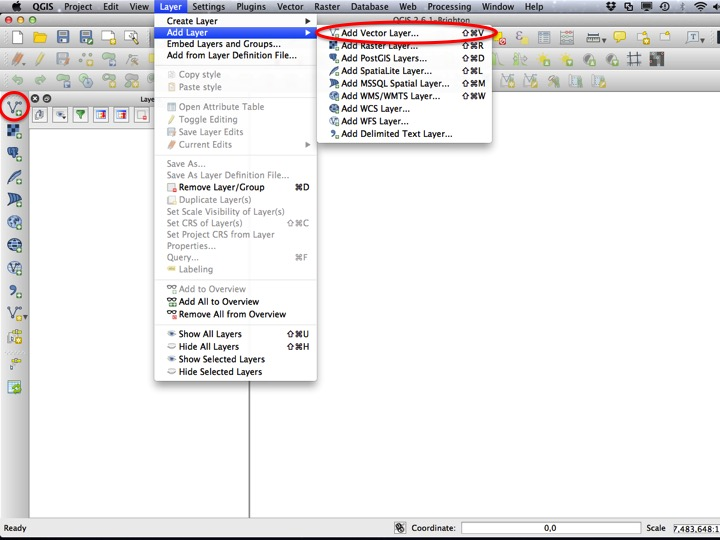

Browse for a file.

Choose "Canada-WGS84.shp" from the "02-03 First Map Data" folder within the tutorial data directory.

Remove the layer.

Another way to add a layer is to drag and drop from the file manager. Drag the "Canada-WGS84.shp" from the "02-03 First Map Data" folder into the "Layers" panel (you will always drag the ".shp" file when adding vector layers in this way).

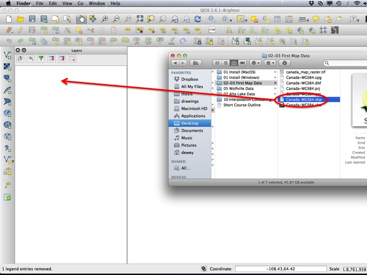

### Basic Map Tools

Useful tools for getting around the map are the "pan" tool (the hand), the "zoom" tools, and the "identify" tool. 

Choose the "identify" tool.

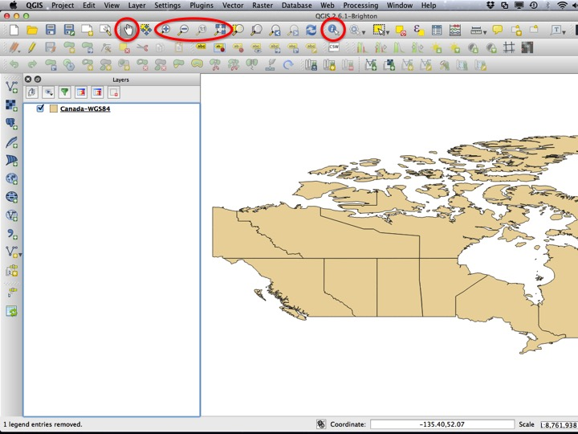

Click on one of the "features" on the map. A list of "attributes" should appear in the QGIS window.

Attribute values can also be accessed through the **attribute table**. Right click on the layer in the *Layers* window, and choose *Open Attribute Table*.

In the **attribute table**, **features** are in rows, and **attributes** are in columns.

Click on one of the features to **select** that feature. Next, click on the *Zoom Selected* icon to zoom the map to show that **feature**.

To unselect the feature and return the map to its original position, chose *Deselect Features from All Layers* and then *Zoom Full*.

The map should be zoomed out to all of Canada.

### QGIS Projects

QGIS *Projects* save the state of the map, references to the data that are on your map, and the styles you've defined for your layers. *Saving a project will not save your data*. For this reason, it's usually a good idea to keep your QGIS project file and your spatial data in the same folder. 

To save the map of canada project, choose *Save As* from the *Project* menu.

Enter a file to which the project should be saved (save it within the "02-03 First Map Data folder").

Were you to open the project file again, the map should appear exactly as you left it, provided that you didn't move any of the spatial data relative to the project file.

### Changing the Project CRS

To examine or change the **Project CRS**, click the globe-looking thing in the lower right corner of the QGIS window.

This will open a window enabling you to choose another CRS. A commonly used CRS is the "World Mercator" projection. To find it, type "mercator" into the *Filter* text box, and select "Word Mercator" from the list of CRSs. Select *OK* to apply the change.

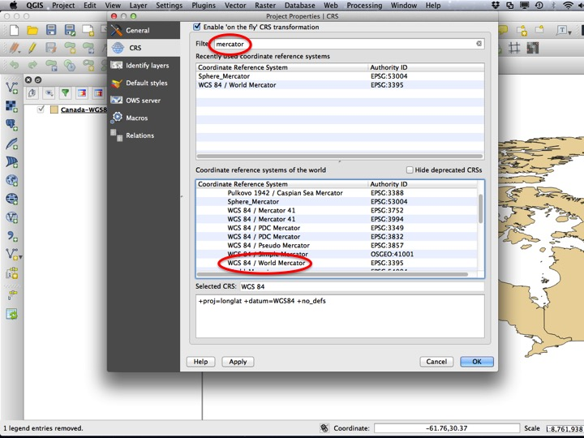

The shape of your map should now appear different. To change the *Project CRS* again, click the globe in the lower right corner of the QGIS window.

The Mercator projection exaggerates areas in the far north, and is usually not appropriate for a nationwide map of Canada. There are several Canadian-specific projections, one of which is the "Canada Albers Equal-Area Conic". This projection provides a reasonable representation of all of Canada.

Your map should now appear like this. To change the *Project CRS* yet again, click the globe in the lower right corner of the QGIS window.

Smaller-scale maps often use the **Universal Transverse Mercator** projection, which approximates small areas well. Nova Scotia is often represented by UTM Zone 20. Choose the "WGS 84 / UTM zone 20N" from the CRS list.

Notice how the meridian surrounding Nova Scotia is represented well by the projection, but other areas are not. To illustrate the effect of chaging the UTM Zone, we will change the Project CRS again.

British Columbia is often represented in UTM Zone 10N. Choose this CRS from the CRS list.

UTM Zone 10 represents British Columbia well, but other areas are distorted. Finally, we will change the CRS one last time.

For the rest of the tutorial, we will use the "World Mercator" projection. You can choose this from your recently used CRS list or by typing "mercator" into the *Filter* text box.

Your map should now look like this.

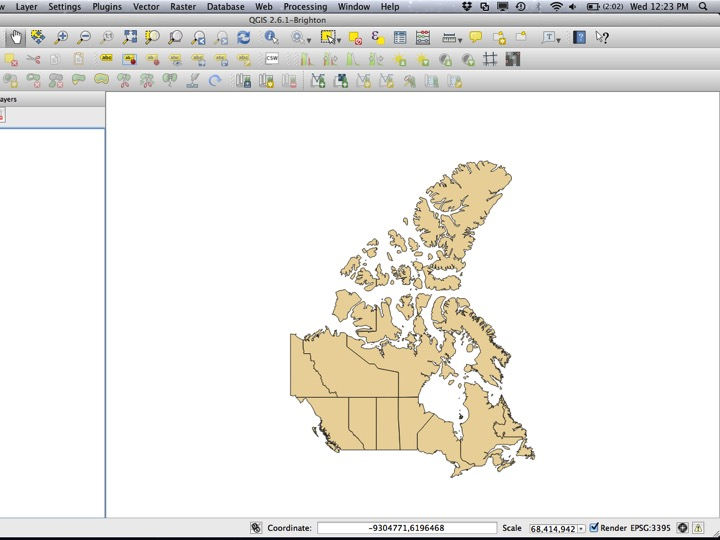

### Raster Layers

So far we have only worked with one **layer** that is a **vector** layer. To add a **raster** layer, choose *Add Raster Layer* from the toolbar on the left (or the *Layers* menu), and select "canada_map_raster.tif" from the "02-03 First Map Data" folder.

When more than one **layer** is in a project, they can be ordered such that one is drawn before the other. Drag the "canada_map_raster" layer below the other layer to change the draw order.

You can also toggle the visibility of a layer. To toggle the visibility, click the check mark beside the layer name.

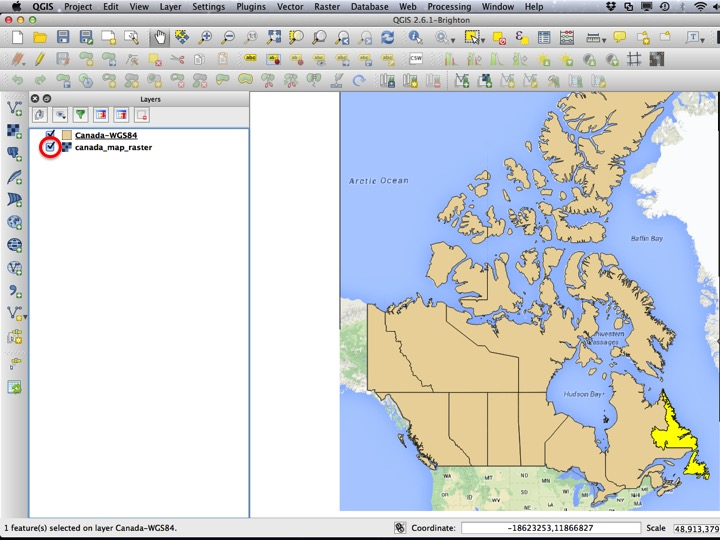

To toggle the visibility back on, click the box again.

### Creating a Print Composer

Choose the *Zoom* tool and zoom in to Nova Scotia.

Next, choose *New Print Composer* from the *Project* menu.

For now, leave the name of the Print Composer blank, and hit OK to create the Print Composer.

The Print Composer window resembles that of basic vector drawing software. You will (almost) always add a map, scale bar, and north arrow to your maps (and you should always add them in that order!). To add a map, choose the *Add Map* icon on the left side of the window.

Next, drag from corner to corner where the map should be located.

The next step is to add a scale bar. Choose the *Add Scale Bar* tool from the left side of the window, and click somewhere on the page.

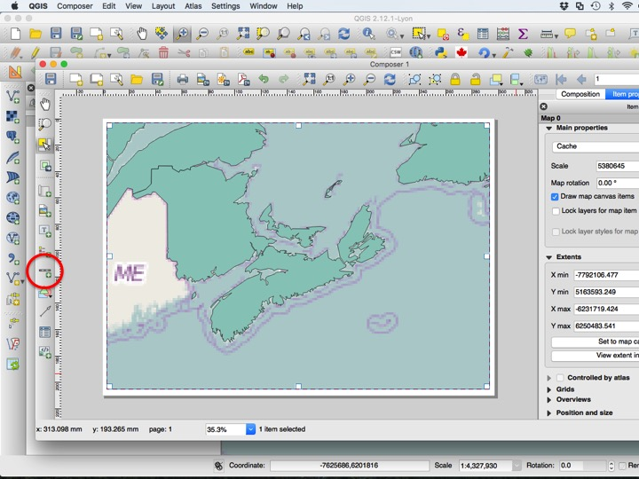

A scale bar synced with the map should now appear. Drag it to where you want it on the page.

Each element on the page has *properties* associated with it. By default, scale bars two "left" segments, which I think look ugly. Change this to zero left segments to remove them.

To add a North Arrow, choose the *Add Image* tool from the left side of the window. Next, drag from corner to corner to approximately where you would like the north arrow on the page.

In the *Item properties*, choose the *...* button to set the image source.

There is a vector drawing of a north arrow included in the tutorial data folder. Choose the north arrow of your choice.

To synchronize the north arrow with the map, check the *Sync with map* check box.

To export the map, choose on of the three export formats provided by QGIS. For now, we will not export the map. Close the composer window to return to your QGIS project.

You can return to the composer at any time by choosing your composer from the *Print Composers* submenu of the *Project* menu. Composers are saved within projects, so when you hit *Save* on your print composer, you will save the project, and when you choose *Save* from within your project, you will save all of the print composers you have created.

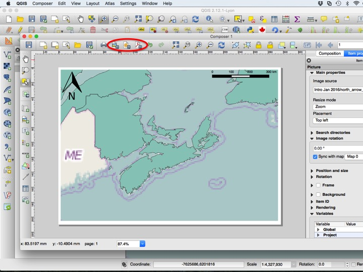

### Multiple Print Composers

It is often desirable to have multiple print composers from a single project. I usually do this when I have the same map that I need for different page sizes (e.g. one for a powerpoint and one for a thesis diagram and one for a publication, etc.), or when I need the same page size with multiple extents when the layers look the same for each map. This significantly reduces the amount of duplication in the map-making workflow.

To make a new composer, choose *New Print Composer* from the *Project* menu.

Choose the *Add Map* tool and drag where you want the map on the page.

By default, the map will show whatever area is shown in the project window when you create the composer. Often, this is not the desired extent. To move the extent shown in the map, choose the *Move item content* tool from the left side of the window. To zoom in or out, you can use your mouse scroll wheel or change the scale in the *Item properties* panel.

Change the extent to show all of atlantic canada. You will always want to set your map size and extent before adding a scale bar.

Next, add a scale bar.

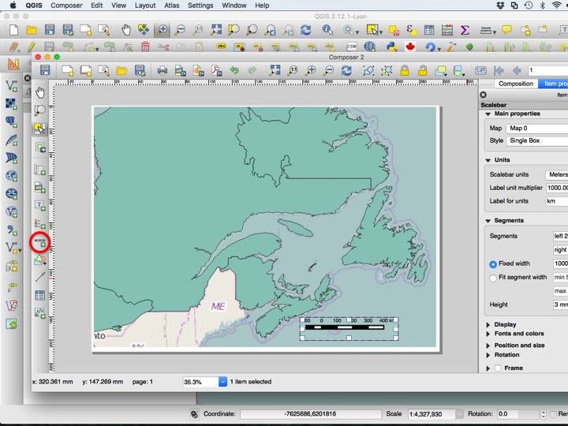

Move and configure the scale bar to your liking, then add the north arrow using the *Add image* tool as before.

You can export the map using any of the three export buttons provided by QGIS. Save the project and close the composer window.

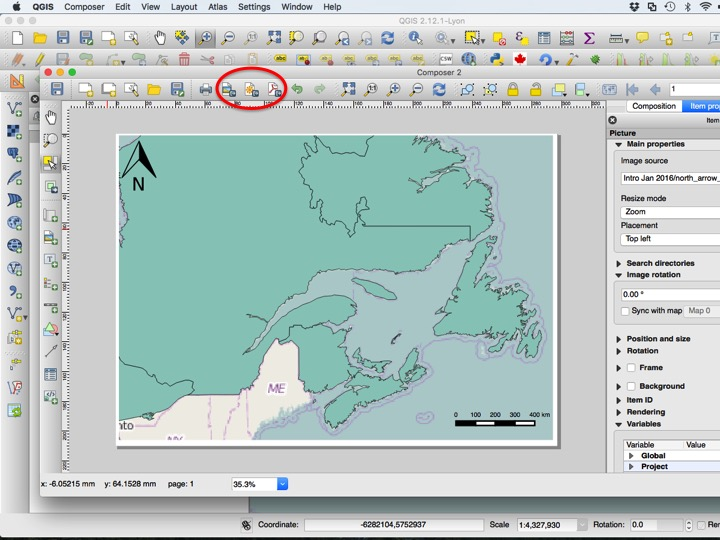

You can return to either print composer using the *Print Composers* submenu from the *Project* menu.

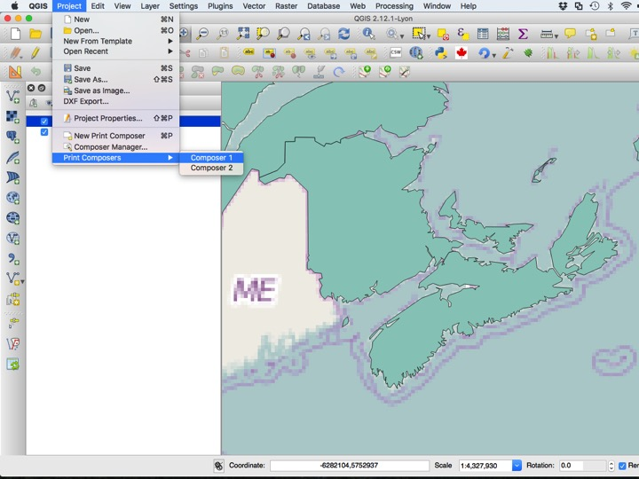

To rename, remove, or duplicate composers, choose *Composer Manager* from the *Project* menu.

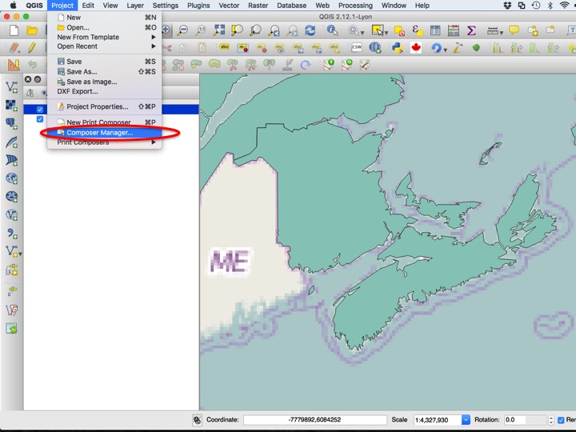

There are several options to choose from, including *Show*, *Duplicate*, *Remove*, and *Rename*.

## Assignment Instructions

The assignment submission is a PDF map generated using the print composer from this map. Make sure it includes a scale bar and north arrow. Make sure to save the project when you are done in addition to exporting the map!

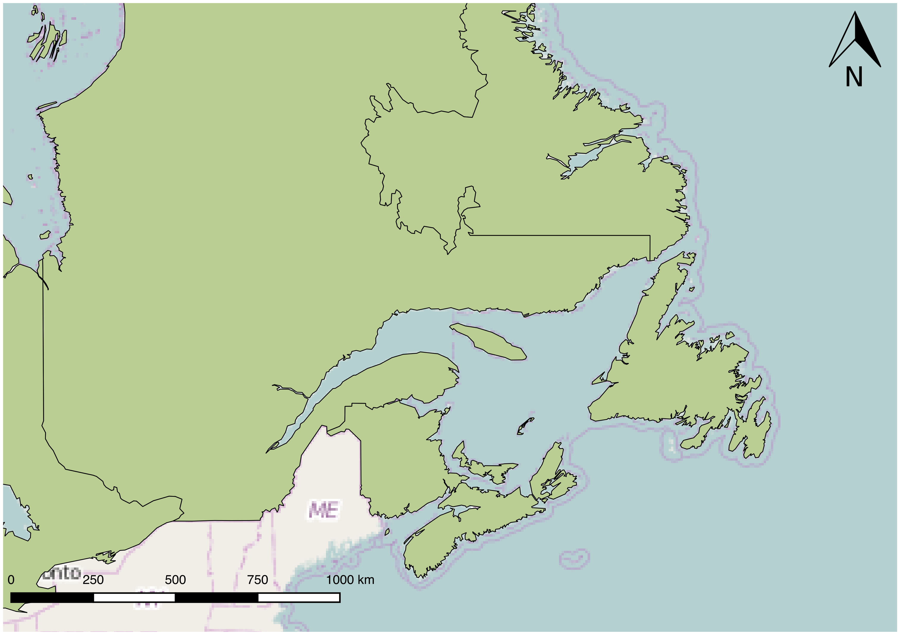
