# A Map of Wolfville {#tutorial-vectorstyle}

## Purpose

* Demonstrate how to assign styles to **vector layers** using a single symbol, a **categorized symbology**, a **graduated symbology** and a **rule-based symbology**.
* Suggest a set of styles to use for common layers such as roads, rivers, lakes, and contours.
* Practice using the _Print Composer_ to export maps from QGIS.

## Tutorial

* Add layers
* Single symbols
    * Style simple polygons
    * Style simple lines
    * Style simple points
    * Style advanced polygons
    * Style advanced lines
    * Style advanced points
* Categorized Symbols
* Rule-based Symbols
* Graduated Symbols

### Adding the Data

To start, we're going to add a lot of layers to the map at once. It's quite time consuming to do this using the *Add Vector Layer* dialog, so I suggest using the drag-and-drop approach, dragging the "CanVec Data" folder into the *Layers* panel. If you do use the *Add Vector Layer* dialog, remember to only select the ".shp" files.

Select all of the vector layers, then choose *OK*.

### Simple Polygons

The map looks nothing like a topographic map, which is, in the end, what we are trying to accomplish. The first layer we will modify is the "water_poly" layer. We will first open the *Layer Properties* dialog, which you can open by double-clicking on the layer, or by right-clicking the layer and selecting *Properties*.

Choose the *Style* tab, and then click on the *water* layer style. Choose *OK* to apply the style and close the dialog.

Next we will modify the vegetation layer. Open the *Layer Properties* dialog for this layer by double clicking, or right-clicking and selecting *Properties*.

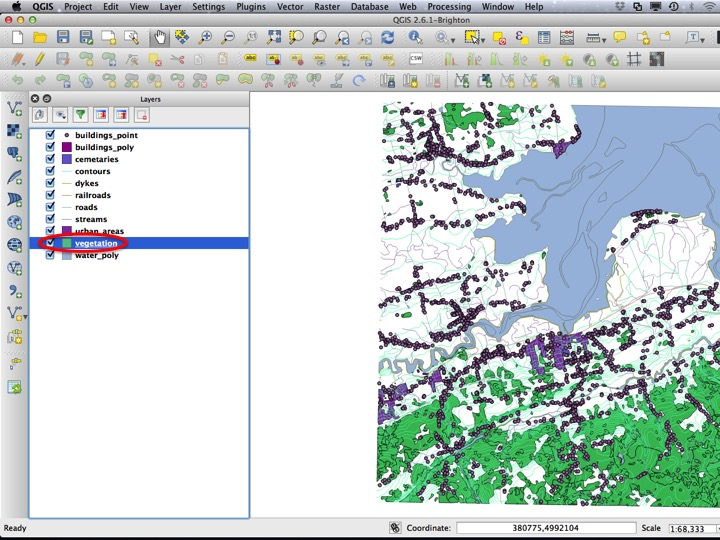

Choose the "Green" style, and click *OK* to dismiss the dialog and apply the style.

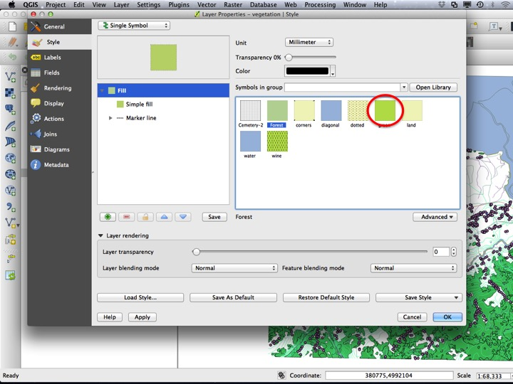

Next, we will modify the "urban_areas" layer. Open the *Layer Properies* dialog for this layer.

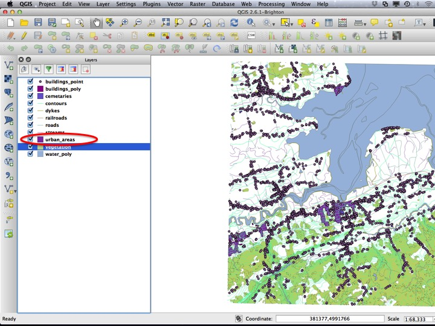

There is no acceptable pre-made style for this layer, so we will have to make our own. The simplest modification possible is to change the fill colour. To do this, click on the color, or click on the little arrow next to the color and click *Choose color...*.

This will open a dialog that allows you to choose a colour. Urban areas are often represented in yellow fill on maps, so choose a shade of yellow (or another colour of your choice). Click *OK* on both dialogs to apply the style and close the dialogs.

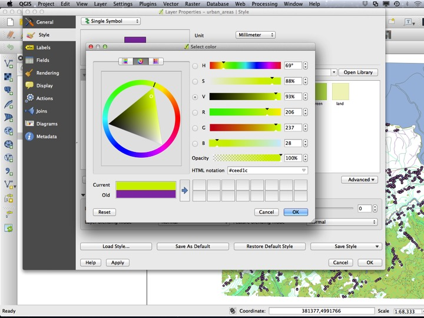

There is also a bulidings polygon layer. Open the *Layer Properties* dialog for this layer.

Then, choose a black fill and choose *OK*.

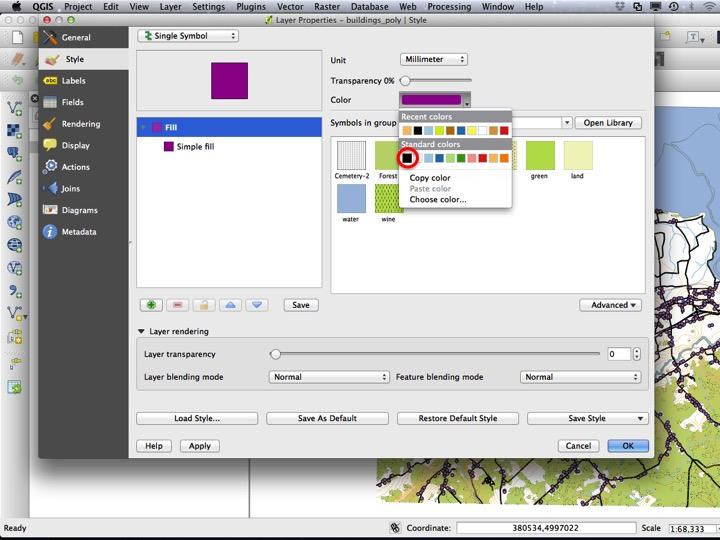

### Simple Lines

Next, we will modify the streams layer. Open the *Layer Properties* dialog for the stream layer.

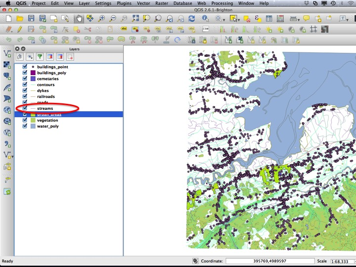

QGIS comes with a collection of *Standard colors*, which fit many needs. The light blue is particularly good for representing water layers, such as streams.

The default line width in QGIS is 0.26 mm, however this is too small for streams to be visible. Set the width to 0.5 mm. and choose *OK* to apply the style and close the dialog.

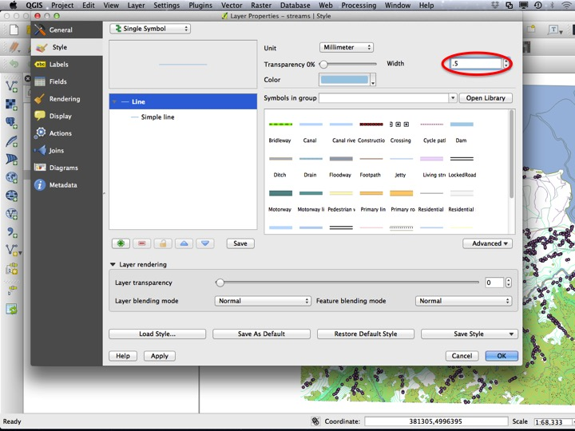

Next, we will modify the "roads" layer. Open the *Layer Properties* dialog for this layer.

Set the colour to black, and the width to 0.75 mm.

The next lines layer we will modify is the "contours" layer. Open the *Layer Properties* dialog for this layer.

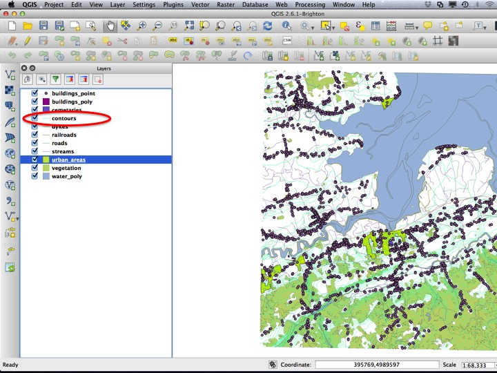

You can choose one of the standard colours for the contours, or a better one if you have one offhand.

### Simple Points

The only point layer on this particular map is the point buildings layer. To modify its style, open the *Layer Properties* dialog.

There are a few choices for point shapes, and for the buildings layer we will choose the square shape with a *Size* of one. Choose *OK* to apply the style and close the dialog.

### Symbol Layers

There are some layers that can't be represented with a simple line. A good example is the "railroads" layer, which is typically represented by a line with various cross-hatches. There is no built-in symbol for this in QGIS, so we will have to create one ourselves. Open the *Layer Properties* dialog to start.

First, set the *Color* to black. Then click the green "+" symbol to add a *Symbol layer*.

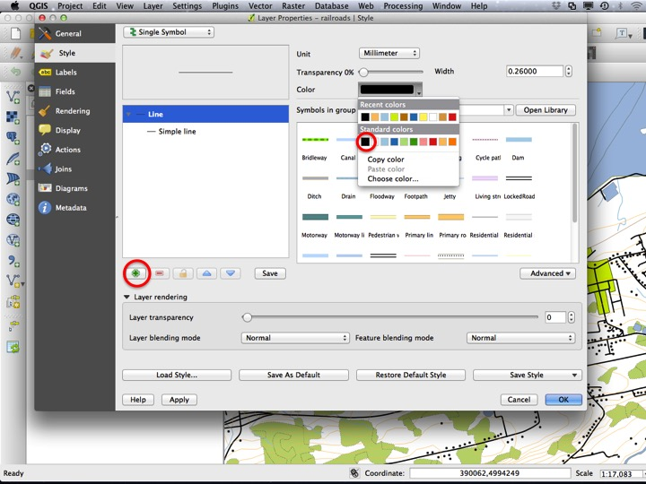

This will add another symbol that will be drawn on top of the black line. Under *Symbol layer type*, choose *Marker line* instead of *Simple line*.

Next, we need to customize the marker that is drawn repeadedly on top of the original black line. Choose the *Simple marker* symbol layer to customize this marker.

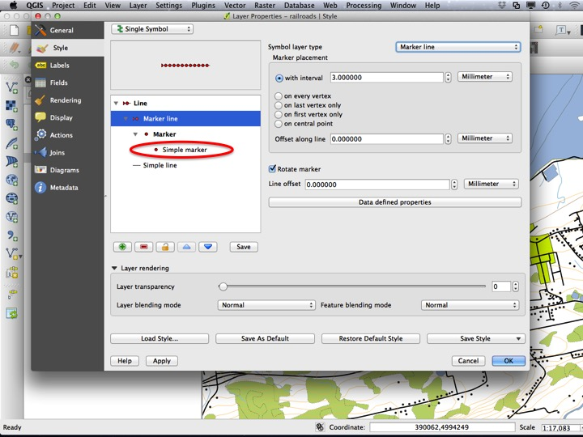

Choose the vertical line marker, and press *OK* to apply the style and close the dialog.

A similar symbol is the symbol for dykes or berms. To modify this style, open the *Layer Properties* dialog for the "dykes" layer.

Change the colour of the line to black, and choose the green "+" symbol to add a symbol layer.

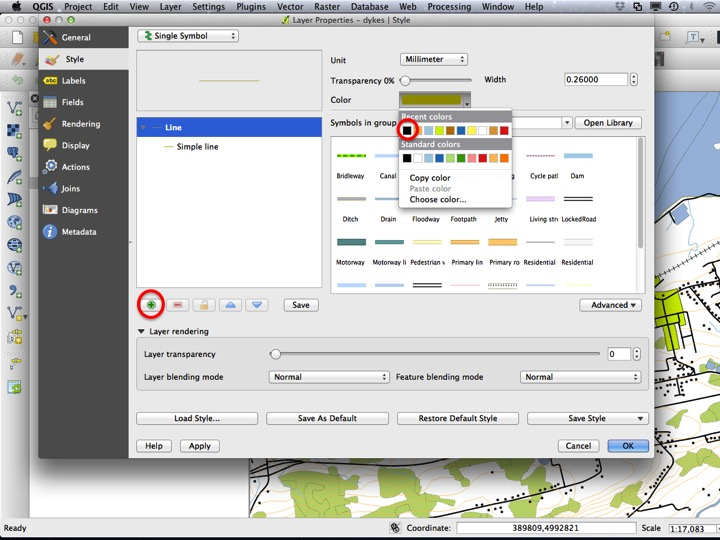

Change the new *Symbol layer type* to a *Marker line*.

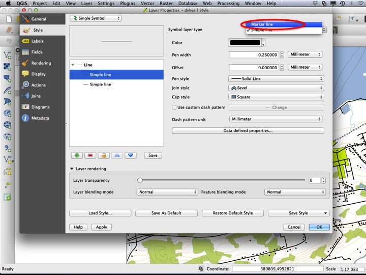

Choose the *Simple marker* symbol layer, and change the marker to the vertical line.

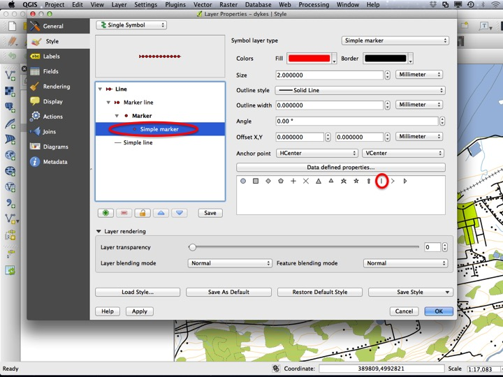

The symbol is now the same as the railroad symbol. To make the ticks to on only one side of the line, we need to change the size of the tick and the offset of the tick. Change the *Size* to 1.0 mm, and the Y Offset to 1 mm.

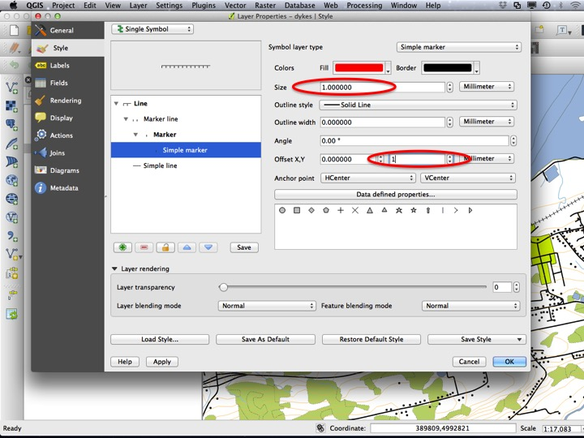

Finally, in the *Marker line* layer, change the interval to 2 mm.

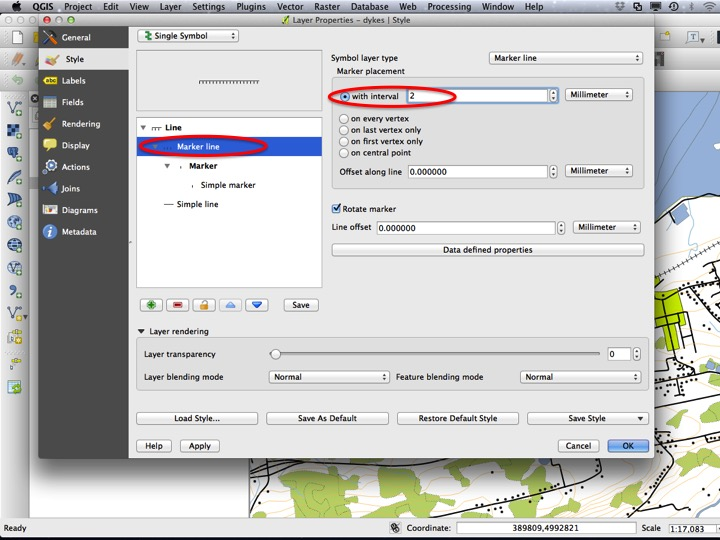

### Rule-based Styles

Next, we will revisit the "contours" layer. Contours on maps generally have labels, and generally have a thicker contour every fifth line. We will now start to use the **attribute table** to dictate various aspects of layer styles through *Rule-based* styles, *Labels*, *Categorized* styles, and (in a later tutorial) *Graduated* styles. *Rule-based* styles are the most complex of the three, however their use in formatting the contour layer is common. Open the *Layer Properties* dialog for the "contours" layer.

From the dropdown at the top left, choose *Rule-based* instead of *Single Symbol*.

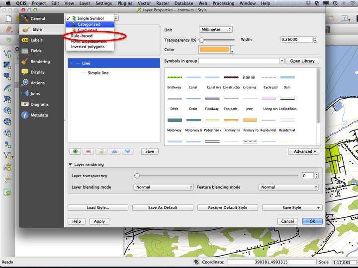

Now, add a new rule using the green "+" symbol.

Next, add a label for the rule. The labe of "major" (as in major and minor contours) is fitting for our application. Click the "..." to create the rule interactively.

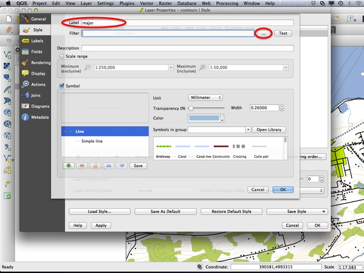

Under *Fields and Values*, select "elevation" and double-click it to add it to the *Expression*.

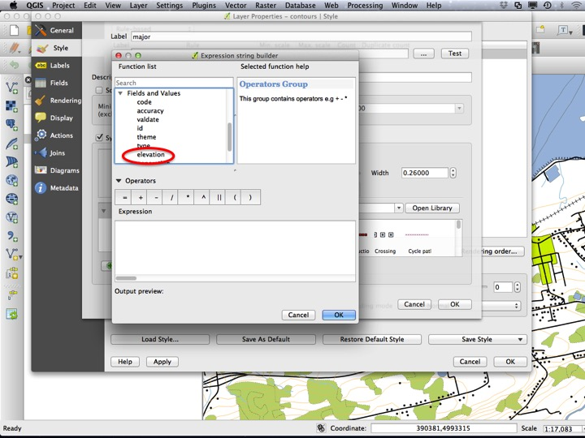

The expression we will use is `("elevation" % 50) = 0`. Without going into too much detail, this will apply our rule to all features where the elevation is a multiple of 50. Since the contour interval for this map is 10, this will be every fifth contour. Choose *OK* to close the dialog.

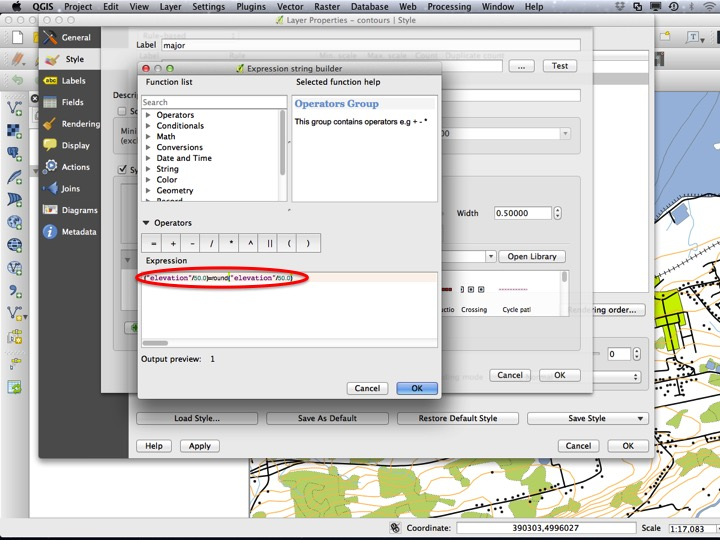

Next, we have to set the style for our "major" contours. This should be the same colour as the original contours, but slightly thicker (a *Size* of 0.5 mm). Choose *OK* to close the dialog.

Choose *OK* on the *Layer Properties* dialog to close the dialog and apply the style.

You should now have some contours that are thicker than others.

### Labels

Contours are generally labeled on topographic maps. To add labels, open the *Layer Properties* dialog on the "contours" layer.

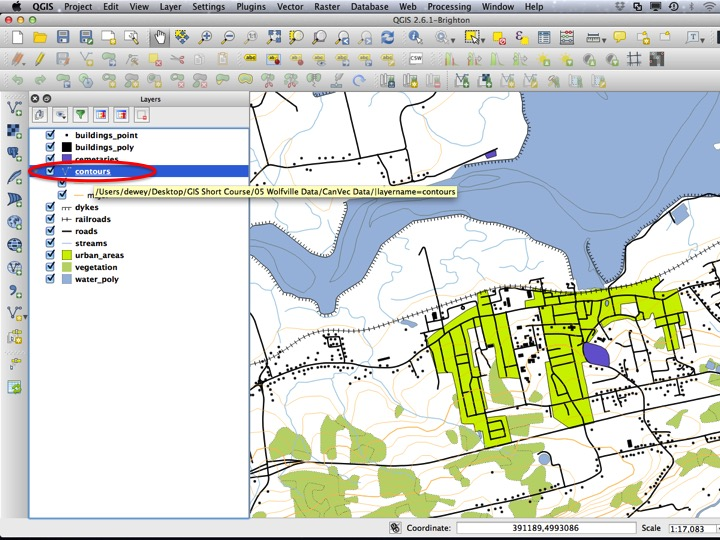

Choose the *Labels* tab, and pick the "elevation" field under *Label this layer with*.

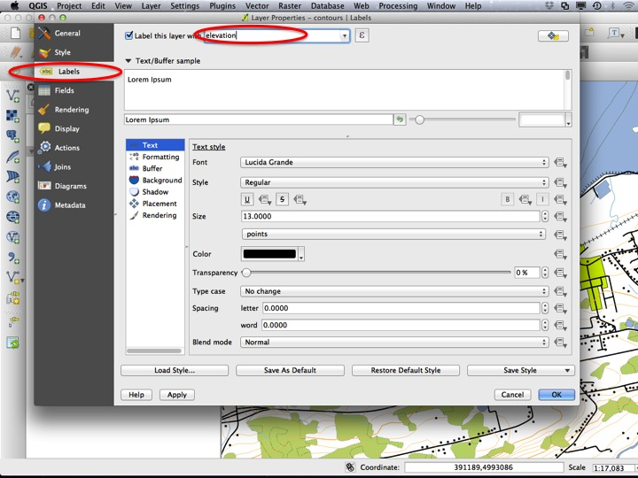

There are a number of additional options for labels, a few of which we will apply to labeling of contours. The first is the text size, which I generally make between 8 and 10 points. For contours, I usually make the label the same color as the contour line itself.

You can also apply a number formatting, which for contours is probably helpful.

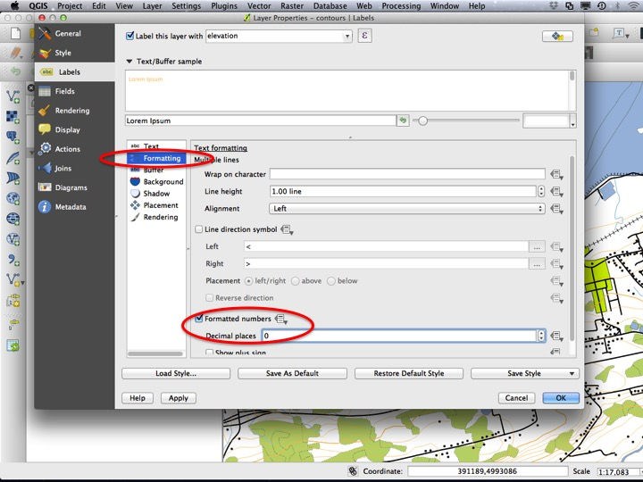

An important component of labels on maps is the *Text buffer*. I always use a text buffer for labels on maps, usually with a *Size* of 1 mm and a color of white. If this is too stark a contrast on a map, I adjust the transparency or change the buffer colour.

Finally, we want to update the placement to make sure contour lines are labeled on top of the line instead of somewhere else. Choose *OK* to apply the labeling and close the dialog.

### Categorized Styles

Currently, the "water" layer looks like it contains separate polygons for different categories of water bodies. We want to label these differently on our map, but to do so we need to know what **attribute** defines the difference between them so we can use it to apply a *Categorized style*. Select the "water_poly" layer and switch to the *Identify* tool.

Click on the centre water polygon in the Minas Basin and inspect its attributes.

Now click on the outer water polygon and inspects its attributes, noting that there is a difference in "permanency" between the two. This make sense, because at high tide these areas are covered in water but at low tide they are not.

To apply the *Categorized* style, open the *Layer Properties* dialog for the "water_poly" layer.

From the dropdown menu at the top of the *Style* tab, choose *Categorized*.

Under *Column*, choose "permanency", then click *Classify*.

In the window, you should see a list of permanency values. To modify the styles for features that have this value for permanency, double click on the row.

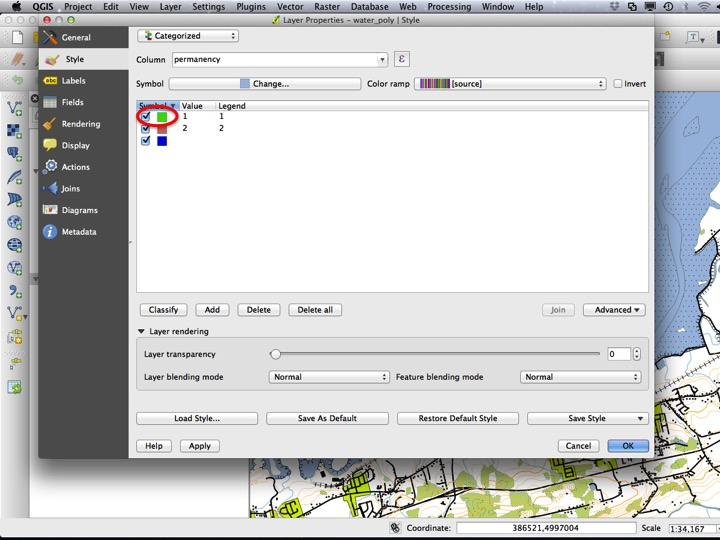

For a permanency value of 1, we simply want a "water" style. Click *OK* to apply the style.

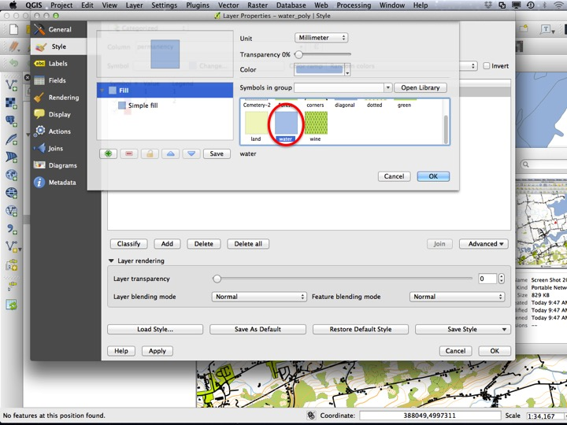

For a permanency value of 2, we want a slightly different symbol. Double click the row to open the dialog to choose the style.

Select the "water" style (this will be the base style), but then click the green "+" sign to add a new symbol layer.

Instead of a simple fill, choose a *Point pattern fill*. This is similar to the *Marker line* we used earlier, but for polygons.

Next, change the pattern of points from a grid to an offset grid by changing the *Horizontal distance* to 3 mm, the *Vertical distance* to 3 mm, and the *Horizontal displacement* to half that value (1.5 mm).

Finally, change the *Color* of the marker to black.

And the *Size* of the marker to 0.2 mm. Click *OK* to apply the style.

Finally, click *OK* to close the dialog and apply the style.

### Polygons with Outlines

Sometimes, a polygon represents an outline more so than an area that should be filled. The "cemetaries" layer is an example of a layer of this type. Open the *Layer Properties* dialog for this layer.

Next, choose *Simple fill* in the symbol layers list to modify the advanced parameters of the fill.

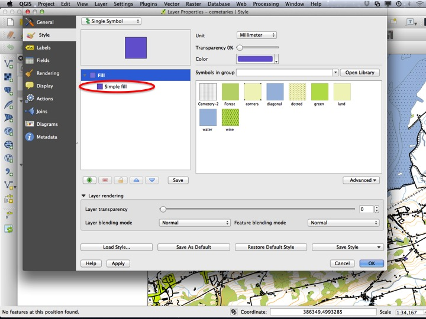

Instead of filling the polygon with a *Solid* fill, choose *No Brush*.

You can also modify the outline style in a similar way to modifying a regular line. Choose *Dash Line* for the outline style.

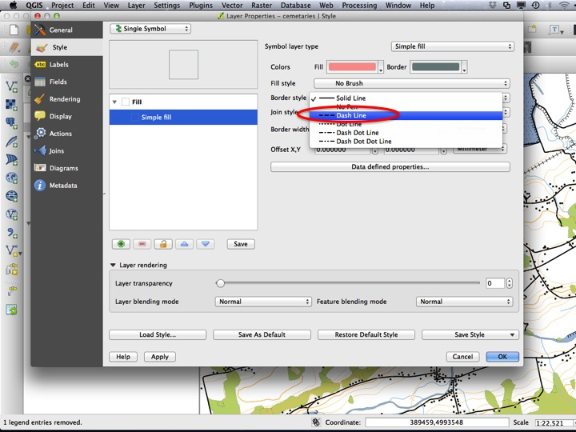

Set the *Border width* to 0.75 mm.

Finally, change the border color to black and press *OK* to apply the style and close the dialog.

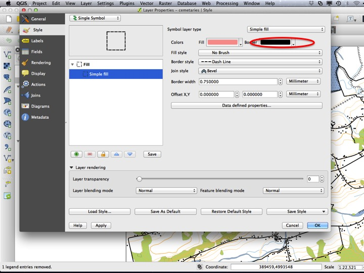

### Point Symbols at Multiple Scales

If you zoom in close, you will notice that no matter how far zoomed in/out you are, buildings will always be 2 mm in diameter. This works well for some zoom levels, but not others. To modify this behaviour, open the *Layer Properties* dialog for the "buildings_point" layer.

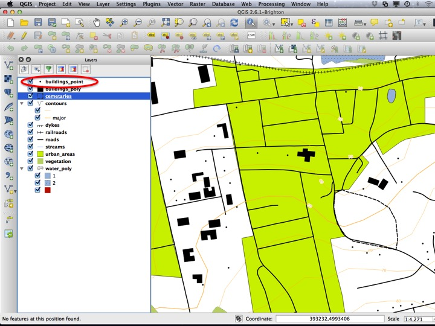

Instead of refering to the symbol *Size* in millimetres, we can also specify a size in *Map units*. For buildings, that represent a structure on the ground, this is a good choice.

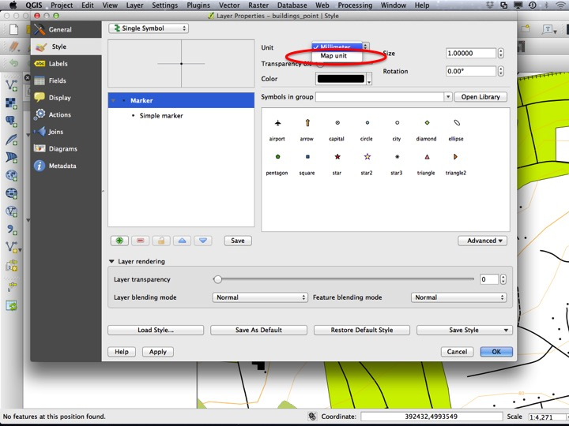

Set the *Size* to 20 (a good approximation, since buildings are about 20 m across, and our project CRS in in metres). Press *OK* to close the dialog.

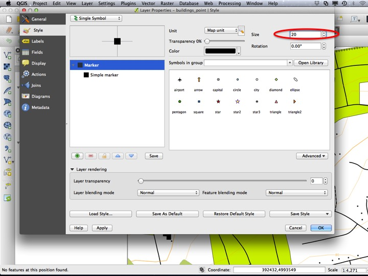

Buildings should now be appropriately sized when zoomed in...

...and zoomed out.

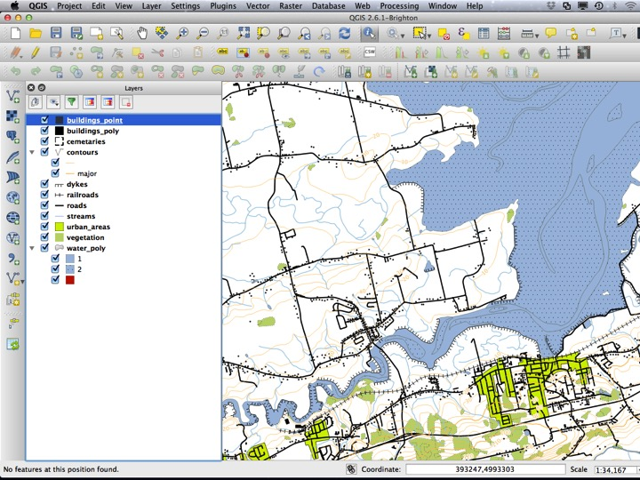

### Raster Layer Styles

Raster layers are slightly different to style, since they contain a single geometry (collection of cells) that may represent many different types of values. We will start by adding a Digital Elevation Model (DEM) of the Wolfville Area. You can do this using the drag-and-drop approcach or using *Add Raster Layer*.

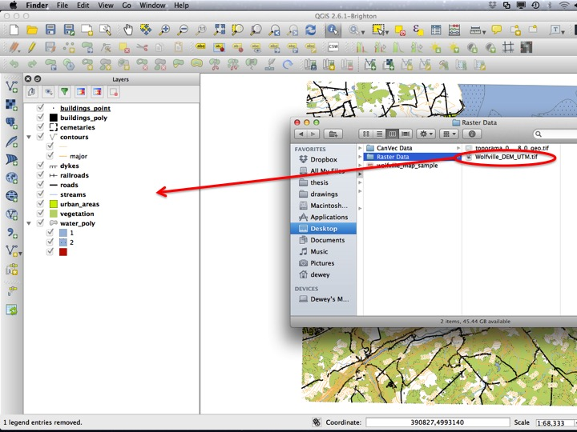

With any luck, you should see a black-and-white raster layer appear over Wolfville. The default style for a raster layer is black as low and white as high. Just as we can change the defaults for vector layers, we can change the style of raster layers by opening the *Layer Properties* dialog.

There are several options for styling a raster layer. The default is *Singleband gray*, however *Singleband pseudocolor* is the most useful.

To apply a colour gradient to the raster image, you can select a colour gradient, and then click *Classify*.

If you apply the style, you should see something like this.

You can also increase the transparency of the raster to see below it.

In general, you will also want to rearrange the layers so that each is visible. A good rule of thumb is to put raster layers at the bottom, followed by polygons, followed by lines, followed by points. This isn't always the best ordering, but will usually produce a good place to start.

Your map should now look like this.

## The Assignment

What we've just done is the "first pass" to make things look "about right". You will always have to do this before you tweak all the colours and styles to be just how you would like. Over many years of creating maps with Canvec Data, I've settled on the following as my "best guess" for creating a good map. You'll learn how to download CanVec data of your own in the [next section](06_Online_GIS_Data_Sources.html).

### Water Polygons

Unless there's something that looks funny, I usually go with the pre-defined "water" style with no outline. The details of this are as follows:

* Fill: #a5bfdd (hint: you can copy the text including the hash tag and choose *Paste Color* from the color chooser)
* Outline: usually none (outline style as *No Brush*)

### Stream Lines

* Colour: The same as the fill colour for the water polygons (#a5bfdd).
* Size: 0.5 mm

### Contour Lines

* Rule-based style, with the rule for major lines as `("ELEVATION" % 50) = 0`.
* Colour: #bb8c6e
* Size: 0.26 mm (minor) and 0.4 mm (major)
* Labels: Text colour the same as the contour line, font size 8 points with a white, 0.5 mm text buffer positioned on top of the line.

### Building Polygons

* Colour: black
* Outline: None

### Building Points

* Shape: Square with no outline
* Size: 25 (in map units). You will have to have a project CRS that is in meters (most other than lat/lon are).

### Wetlands

There were no wetland (or "saturated soils", as NRCan calls them) layers in this dataset, but they are available.

* Fill: #d0eadd (this is a light green) with a simple fill layer above it with colour #a5bfdd and *Fill style* "Dense 4".
* Outline: None

### Roads

Roads are tricky, because to properly render them as a *Categorized* style where freeways are a specific colour requires some advanced QGIS style magic. Usually you want them to be black with a width of 0.5 mm or so. If you really want to try a classfied symbology, you can classify them by the `ROADCLASS` field. You will have to enable *Symbol levels* for the built-in road symbols to function properly.

### Railways

The railway symbol I always use is the one I've described here, usually changing the size of the crossways symbol and the spacing of the ticks to suit the final project.

### Urban Areas

I almost never include this layer, but occasionally it helps. Since I never incluce it, I don't have a special colour that I can suggest. Sorry!
