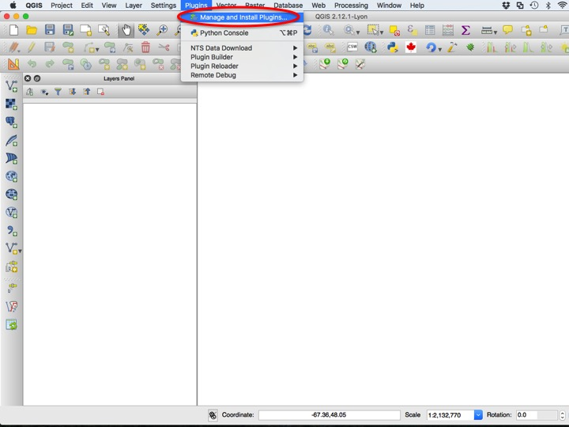
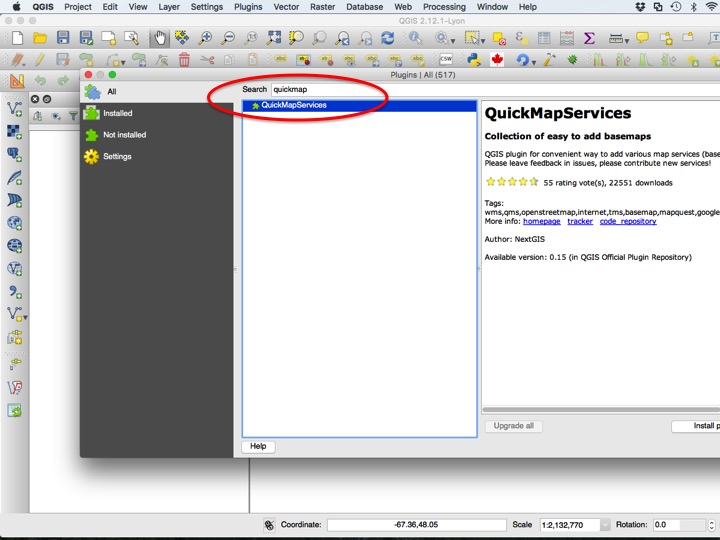
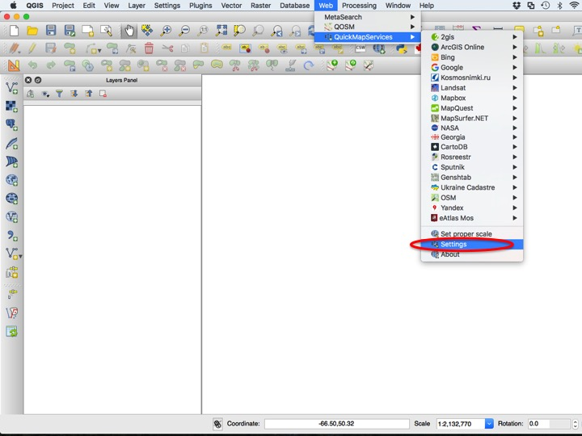
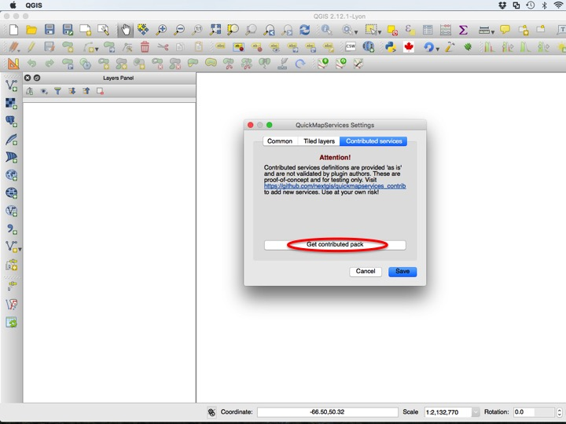
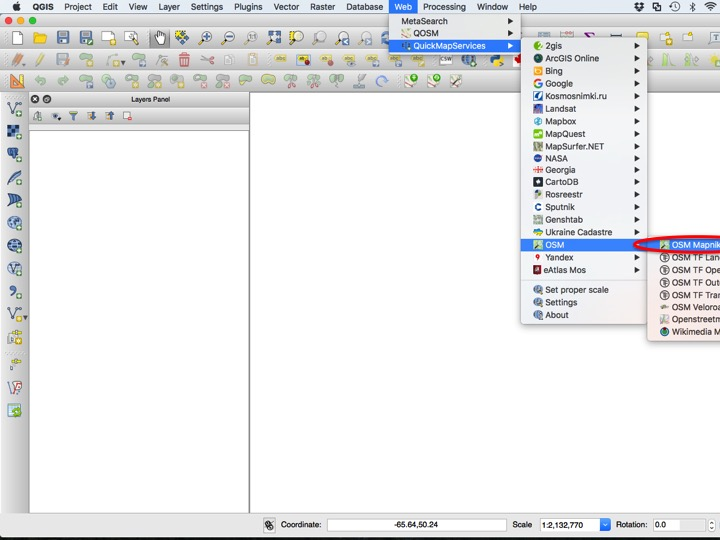
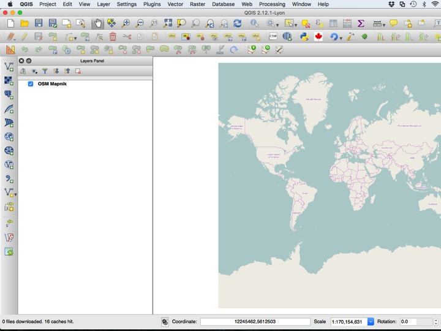
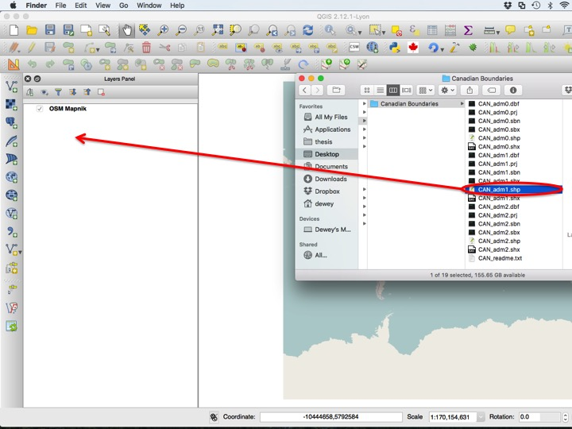
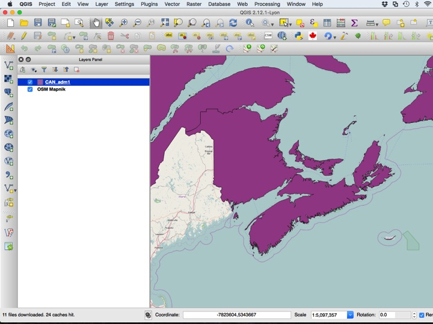
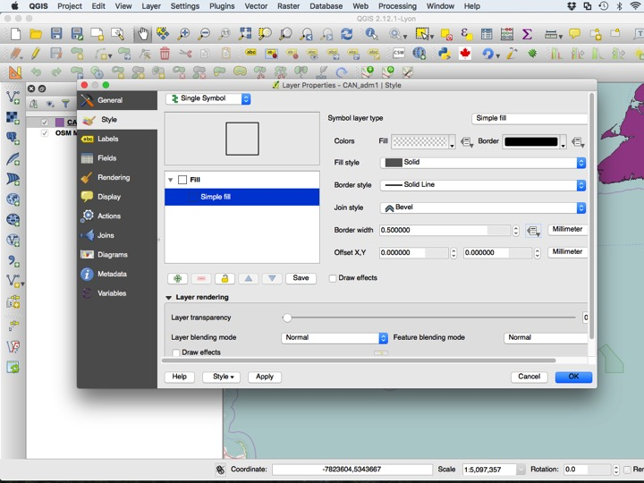
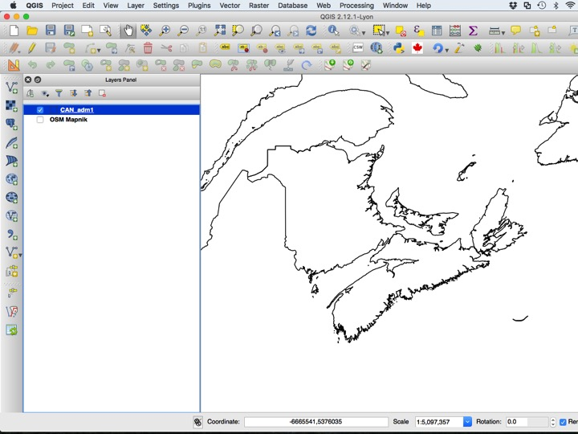

# The Quick Map Services Plugin {#tutorial-qms}

This tutorial will introduce you to another online resource: tiled maps. These are often not great for publishing maps, but can be very helpful when exploring data, and trying to make sure all data align. These services also occasionally provide satellite imagery. This functionality depends on the [Quick Map Services plugin](http://nextgis.com/blog/quickmapservices/), which we will have to install from the QGIS Plugins repository. To install the plugin, choose *Manage and Install Plugins...* from the *Plugins* menu.

## Purpose

* Demonstrate the installation use of the Quick Map Services plugin

## Tutorial

This tutorial will introduce you to another online resource: tiled maps. These are often not great for publishing maps, but can be very helpful when exploring data, and trying to make sure all data align. These services also occasionally provide satellite imagery.

### Installing the QMS Plugin

This functionality depends on the [Quick Map Services plugin](http://nextgis.com/blog/quickmapservices/), which we will have to install from the QGIS Plugins repository. To install the plugin, choose *Manage and Install Plugins...* from the *Plugins* menu.

Next type "quickmap" into the *Search* box, and click *Install plugin* to install. Close the Plugins dialog.

You may wish to add the full spectrum of tiled map sources, which you can do by opening the *Settings* dialog in the *QuickMapServices* menu.

Chose the *Contributed services* tab, then click *Get contributed pack*.

### Adding a QMS Tile Layer

You can add any map service you would like, but we will add the *OSM Mapnik* style. Choose the service you would like to display, and click it to add it as a layer.

You can now zoom in, zoom out, and pan just like you would with a normal map. You can even use these layers in a print composer, although any text will often be too small to be legible in the final product.

### Adding a GADM Layer

Several GADM files are included in your tutorial folder. Add the "CAN_adm1.shp" file to the layers window.

Typically, these boundaries should be displayed with no fill, which you can arrange using the *Layer Properties* dialog.

A typical basemap using GADM looks something like the map below.

