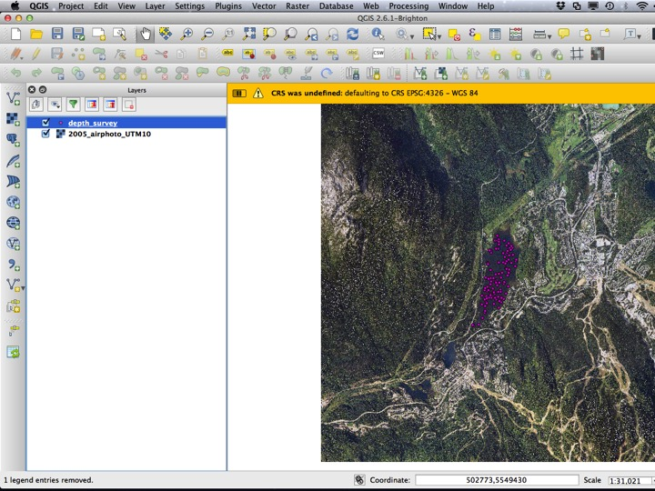
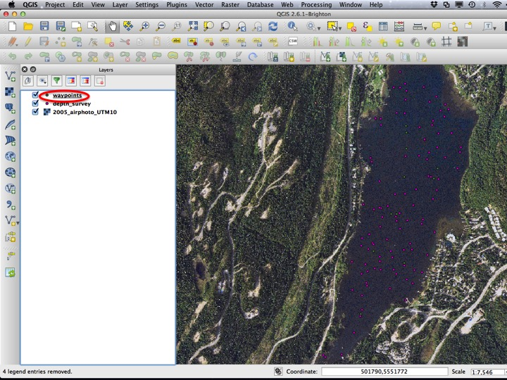
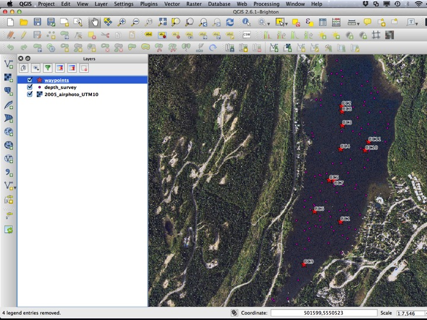
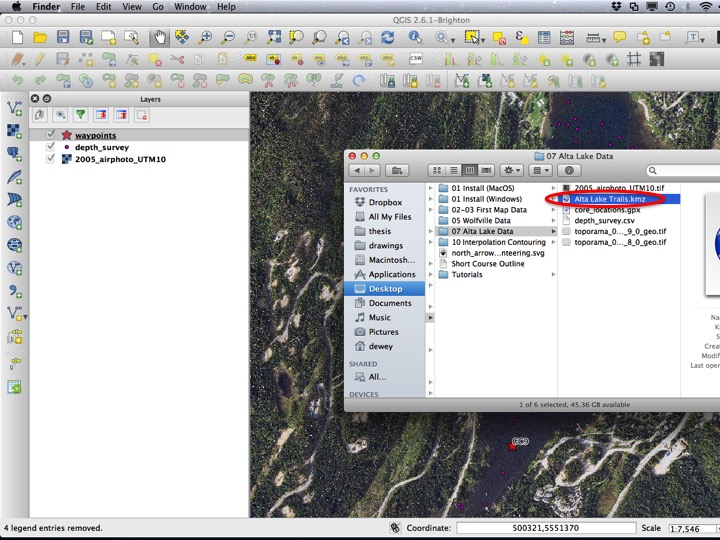
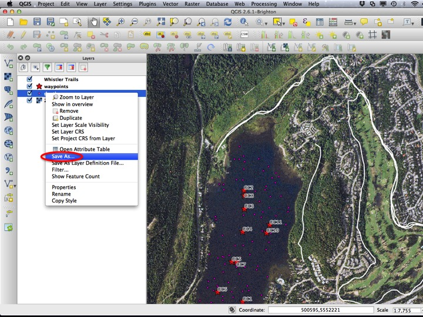
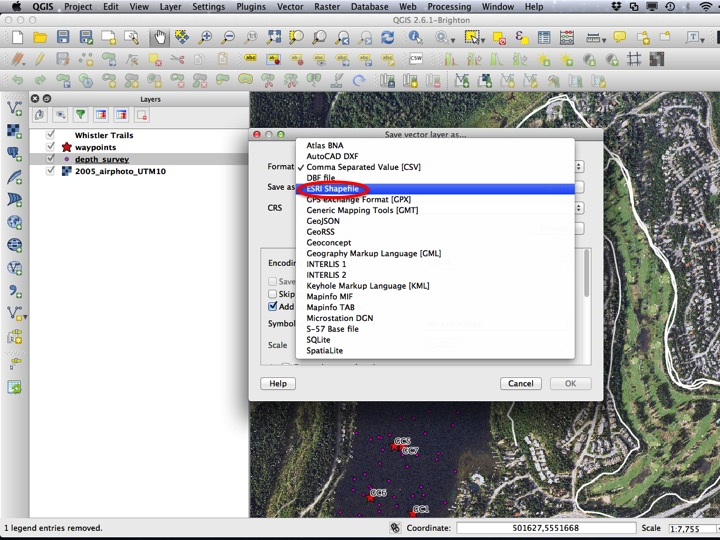
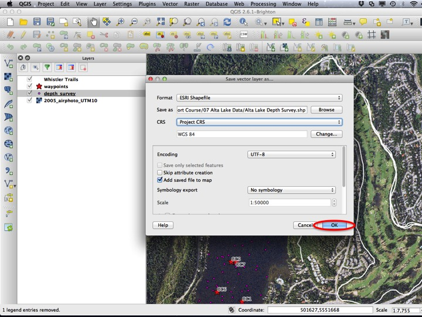
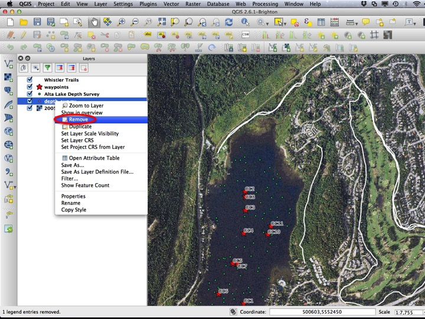
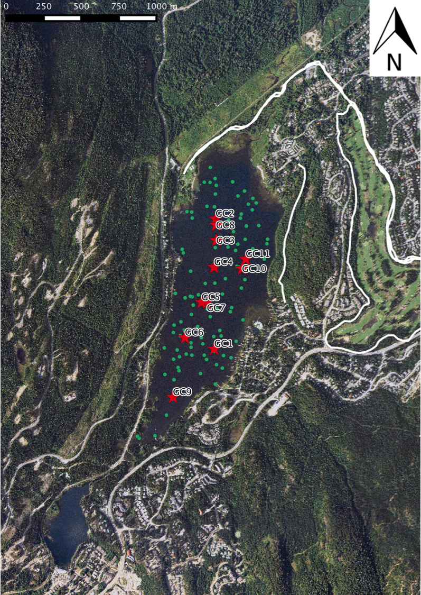

# Preparing GIS Data {#tutorial-dataprep}

## Purpose

* Demonstrate how to create a CSV in Excel and import it into QGIS
* Demonstrate how to create a KML file in Google Earth and import it into QGIS
* Describe additional data formats that exist and how to import them to QGIS
* Demonstrate how to convert vector layers from one format to another

## Tutorial

* Create points csv
* Create cores KML
* Describe GPX format
* Add layers to QGIS
* Save layers from QGIS

In a previous version of this tutorial, I used a georeference airphoto as a backdrop. Instead, use the skills you learned in the [basemap data](06_QGIS_Basemap_Data.html) tutorial to add a basemap of your choosing (OSM Mapnik is always a good bet).

### Adding CSV Data

First, we will add a Comma Separated Value (CSV) file. To open the import dialog click on the *Add Delimited Text Layer* icon.

You will then have to choose a file to open. Click the *Browse...* button.

Then, navigate your way to the "depth_survey.csv" file within the "07 Alta Lake Data" folder.

The next thing you have to ensure is that the *X field* and *Y field* are properly set. For this file they should be "lon" and "lat", respectively. Hit *OK* to add the layer.

Right click on the layer you've just added and choose *Zoom to layer*. This should zoom you to the extent of the layer. If you've done things correctly, it should be over Alta Lake, near the town of Whistler, British Columbia. Note that there is a warning that we did not define our CRS. If you remember, there is the Project CRS, and Layer CRS. The Layer CRS refers to what the creator of the layer meant when they stored their XY coordinates. I created this layer, and these coordinates came off of a GPS. GPS latitude longitude coordinates are in the WGS84 coordinate reference system, so the default in this case is correct.

If your coordinates happen to not be in lat/lon, you can specify the layer CRS by right clicking on the layer and choosing *Set Layer CRS*. You don't need to do this for the layer we've just added.

### Adding GPX Data

GPX (or GPs eXchange files) are a common output of GPS units. QGIS can read these like any other vector file format, but since the GPX file may contain one or more different layers, the process is more like adding a folder of vector files.

You can add a GPX file by dragging it into the *Layers* panel, or through the *Add Vector Layer* dialog.

QGIS gives us the option of importing waypoints, tracks, routes, or the nodes of tracks or routes. To see what the file contains, it's a good idea to add all of the layers.

Some of these layers don't contain any information (or contain information we don't want). Remove all the layers except for the "waypoints" layer.

Now we're going to do a little more practice with layer styles. We can't see the core locations very well in the current styles, so we will update them. Open the *Layer Properties* dialog.

Choose a different shape, and a colour that has some contrast with the background.

It's also worth labeling this layer, because each core location has a name. GPX files all have the same fields, and "name" is the one that gets populated with the name you typed on your GPS. You should also be sure to add a *Text Buffer* around the text.

Your map should look something like the image below.

### Google Earth KML/KMZ files

Some geospatial information is distributed in KML/KMZ form, which is the format used by Google Earth. Both types of files should work in QGIS, however KML is slightly more reliable. You can import a KML file to QGIS by dragging the KML file into the *layers* panel, or through the *Add Vector Layer* dialog.

This layer also doesn't show up that well by default, so we will update its appearance.

From the *Style* tab, choose a colour that has some contrast with the background, and make the line wider.

### Saving Vector Files

If all you're doing is making a map with your imported data and you don't need to modify it or use it for any kind of processing, it's fine to save your QGIS project as is without converting the data to another type of vector layer. Most of the time, you will need or want to save a copy of your data in shapefile form so that you can edit/maniuplate it within QGIS.

To save a vector layer, right click the layer and choose *Save As...*.

In the *Format* dropdown, select "ESRI Shapefile".

Next, choose the file to which you would like to save the layer.

Save the layer in the same folder as the original data, named something sensible.

You will probably not want to mess with the CRS, but if you would like to save a layer in a new CRS (you will want to do this if you do any kind of processing), you can select it in this dialog.

Choose *OK* to save your vector layer.

When you do this, a new vector layer should appear in your *Layers* panel. Remove the old layer (it will be confusing to you later).

Your map should now look like this.

## The Assignment

The assignment for this module is a PDF map of Alta Lake. Use the Print Composer to generate a map with the depth survey points and the QMS basemap. When you've completed the assignment, it should look something like the image below.

